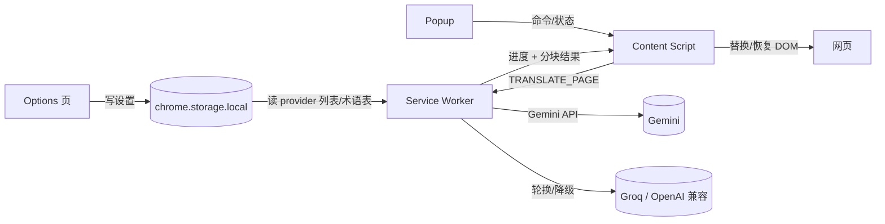

# Edge AI 网页翻译扩展 — 项目规格（M0 契约）

> 本文件是项目唯一权威约定。M1–M5 的所有实现都必须以此为准；如有变更，先改本文件再改代码。

## 1. 项目目标

开发一个 Edge 浏览器扩展（Manifest V3，TypeScript + Vite），实现高质量的整页网页翻译：

- 源语言：英语、日语（自动检测或手动指定）；目标语言：简体中文（可配繁体）。
- 默认使用 Google Gemini 免费档；额度用尽/失败时自动轮换到备用 key，最后降级到 Groq 免费档（OpenAI 兼容接口）。
- 支持术语表（手动维护 + JSON 导入导出），翻译时保留代码、链接和页面格式。
- 仅供本人使用并打包分享给朋友，不上架插件商店，不内置任何 API key。

## 2. 技术架构



职责边界（MV3）：

- **Content Script**：提取可见文本块、按分块结果替换/恢复 DOM、显示页内进度条。不做任何 API 请求。
- **Service Worker**：所有 API 请求的唯一出口。负责分块、提示词组装、调用 provider、重试、key 轮换、进度上报。
- **Popup**：总开关、目标/源语言选择、翻译/恢复按钮、当前 provider 状态展示。
- **Options 页**：provider 列表（key、模型、endpoint）、代理开关、术语表管理、高级参数。

原因：MV3 中 content script 的跨域豁免正在被移除，API 请求放 service worker 是唯一稳妥做法。

## 3. 模块分工（M0–M5）

| 模块 | 职责 | 产出 | 验收 |
| --- | --- | --- | --- |
| M0 契约 | 本规格 + 共享类型 | `SPEC.md`、`src/shared/types.ts` | 所有模块引用同一套类型，无重复定义 |
| M1 脚手架 | Vite + TS + MV3 工程、构建与打包 | 目录结构、`manifest.json`、构建脚本、zip 产物 | `npm run build` 产出可加载进 Edge 的 dist，zip 可分享 |
| M2 API 层 | provider 抽象、提示词、重试、轮换 | service worker 中的翻译引擎 | 模拟各错误类型时行为符合第 7 节策略 |
| M3 页面引擎 | 文本提取/过滤、分块、DOM 替换恢复、进度 | content script | 在真实页面（含代码块/链接的页面）上正确翻译与恢复 |
| M4 UI | popup + options | 两个页面 | 设置持久化、导入导出生效、总开关生效 |
| M5 集成 | 端到端联调、修 bug、打包说明 | 可用扩展 + 安装文档 | 走完"安装→翻译→恢复→换 key"全流程 |

依赖顺序：M1 →（M2、M3 可并行）→ M4 → M5。

## 4. 功能清单（v1）

1. 点工具栏图标或 popup 按钮，对当前普通 HTML 页面做整页翻译（替换原文）。
2. popup 提供总开关：关闭即恢复原文，并禁止再次翻译。
3. 源语言：自动检测 / 英语 / 日语；目标语言：简体中文（可切繁体）。
4. Provider 有序列表：第一项优先，其余备用；额度用尽自动轮换并继续。
5. 自动重试：指数退避，最多 3 次；429 等待后重试；确定性错误（key 无效等）不重试。
6. 页内顶部悬浮进度条："翻译中 12/45…"、失败原因、完成。
7. 术语表：手动增删改 + JSON 导出/导入 + 内置示例词表（可删）。
8. 隐私：仅用户主动点击才发起翻译；无持久缓存；页面内容只存在于当前页会话内存。
9. 不做：流式输出、双语对照、划词翻译、iframe/PDF/SPA 动态内容监听（v2 候选）。

## 5. 配置与存储（chrome.storage.local）

完整类型见 `src/shared/types.ts`，要点：

```ts
interface ExtensionSettings {
  version: 1;
  targetLanguage: 'zh-CN' | 'zh-TW';        // 默认 zh-CN
  sourceLanguage: 'auto' | 'en' | 'ja';     // 默认 auto
  providers: ProviderConfig[];              // 有序，第一项优先
  glossary: GlossaryEntry[];
  masterEnabled: boolean;                   // 默认 false（不自动翻译）
  autoRetry: boolean;                       // 默认 true
  maxTextBlocksPerPage: number;             // 默认 500
  maxCharsPerRequest: number;               // 默认 1500
  maxSegmentsPerRequest: number;            // 默认 25
  maxRetries: number;                       // 默认 3
  proxy: ProxySettings;                     // 自定义 endpoint 开关
}
```

规则：

- API key 只存 `chrome.storage.local`，绝不写入源码、仓库或 `chrome.storage.sync`。
- 设置项变更立即生效（service worker 收到 `SETTINGS_UPDATED` 后重读）。

## 6. 消息协议

全部消息类型见 `src/shared/types.ts`。核心流程：

1. Content script 提取文本块后发送 `TRANSLATE_PAGE`（一次性携带全部块 + 当前设置快照）。
2. Service worker 按 `maxCharsPerRequest` 分块，逐块调 provider；每块完成发 `TRANSLATE_CHUNK`（内容脚本增量替换 DOM），同时发 `TRANSLATE_PROGRESS { done, total }`。
3. 全部完成发 `TRANSLATE_DONE`；不可恢复的错误发 `TRANSLATE_FAILED`。
4. Popup 通过 `POPUP_COMMAND`（`translate` / `restore` / `get-status`）与 content script 通信；content script 用 `CONTENT_STATUS` 应答。

## 7. API 集成

### 7.1 Gemini（优先）

- 默认 endpoint：`https://generativelanguage.googleapis.com/v1beta`
- 调用：`POST {baseUrl}/models/{model}:generateContent`，`?key={apiKey}`
- 默认模型：`gemini-3.6-flash`（2026-07 发布，免费档可用）；设置 `response_mime_type: "application/json"` 强制 JSON 输出。

### 7.2 OpenAI 兼容（备用，默认指向 Groq）

- 默认 endpoint：`https://api.groq.com/openai/v1`
- 调用：`POST {baseUrl}/chat/completions`，`Authorization: Bearer {apiKey}`
- 默认模型：`llama-3.3-70b-versatile`；开启 `response_format: { type: "json_object" }`。

### 7.3 提示词模板（M2 实现，结构如下）

```
system: 你是专业翻译。把输入的 JSON 数组中的每段文本从 {src} 翻译成 {tgt}。
规则：1) 严格按输入顺序输出 JSON 数组，每项 { id, text }；
      2) 代码、链接地址、专有名词、数字、变量名不得翻译或改动；
      3) 保留换行与空行；
      4) 必须遵守以下术语表（若适用）：{glossary}
user: [{ "id": "...", "text": "..." }, ...]
```

### 7.4 错误分类与处理策略

| 错误 | 判定 | 策略 |
| --- | --- | --- |
| `rate_limited` | HTTP 429 | 等待后重试（计入重试次数），仍失败则轮换下一个 provider |
| `quota_exhausted` | 403 且提示额度/quota | 不重试，直接轮换下一个 provider |
| `auth_failed` | 401 / 403 key 无效 | 不重试，提示"key 无效"，尝试下一个 provider |
| `config_error` | 未配置可用 key | 不重试，提示到设置页添加 key |
| `network` / `timeout` | 连接失败 / 超时 | 指数退避重试（最多 3 次） |
| `server_error` | 5xx | 指数退避重试（最多 3 次） |
| `invalid_response` | 解析失败 | 重试 1 次；仍失败则报错 |
| `cancelled` | 用户恢复原文/切换页面 | 静默终止 |

轮换规则：当前 provider 的 key 触发额度类错误时，把该条目移到列表尾部并选下一个可用条目；当前生效的 provider 名称在 popup 展示。

注意：provider 列表与 key 只由 service worker 从 `chrome.storage.local` 读取，content script 不接触 key；`TRANSLATE_PAGE` 只携带片段与语言/术语表快照。

## 8. 翻译范围与过滤规则（M3 实现）

- 只处理 `body` 下可见的文本节点；跳过 `script/style/noscript/svg/math/code/pre/textarea/select`。
- 跳过隐藏元素（`display:none`、`visibility:hidden`、`[hidden]`、宽高为 0）。
- 链接：翻译可见文字，`href` 与 `title` 属性不翻译。
- `input` 的 `placeholder` 翻译，`value` 不翻译。
- 按 DOM 顺序把连续短文本聚合成文本块；同时受 `maxCharsPerRequest`（1500 字符）与 `maxSegmentsPerRequest`（25 段）双重上限约束，避免单次请求过大导致模型输出截断。
- 单页最多处理 `maxTextBlocksPerPage`（500）块，超出部分提示"部分内容未翻译"。
- 译文替换到 DOM 后，把块标记为已翻译；恢复时按内存映射还原，不刷新页面。

## 9. 术语表

- 词条：`{ id, source, target, category?, note? }`。
- 维护：Options 页手动增删改；导出/导入 JSON 文件（供朋友共享）。
- 应用：拼入提示词让模型遵守（v1 不做硬替换）。
- 内置示例词表（科技/游戏/动漫方向，约 20 条），可整体删除。

## 10. 构建与分发

- `npm run build` → `dist/`；`npm run zip` → `edge-translator.zip`。
- 朋友使用：Edge 打开 `edge://extensions` → 打开"开发人员模式" → "加载解压缩的扩展" 选择解压后的目录；或拖入 `.crx`（M5 提供可选项）。
- 分发包不包含任何 key；每个用户在自己设置里填自己的 key。

## 11. 验收标准

- 在含代码块、长列表、日文假名/汉字混排的页面（如 GitHub README、日文新闻站）翻译正确、格式完整、恢复无损。
- Gemini key 无效、额度用尽、网络断开三种场景下，行为符合第 7.4 节。
- 单页超过 500 块时提示"部分内容未翻译"且不卡死。
- 术语表条目在译文中生效；导入朋友导出的 JSON 后立即生效。
- 打包产物在另一台电脑上加载可用。

## 12. 明确非目标（v2 候选）

流式输出、双语对照、划词翻译、iframe/PDF 支持、SPA 动态内容监听、翻译历史、服务端自部署代理。
